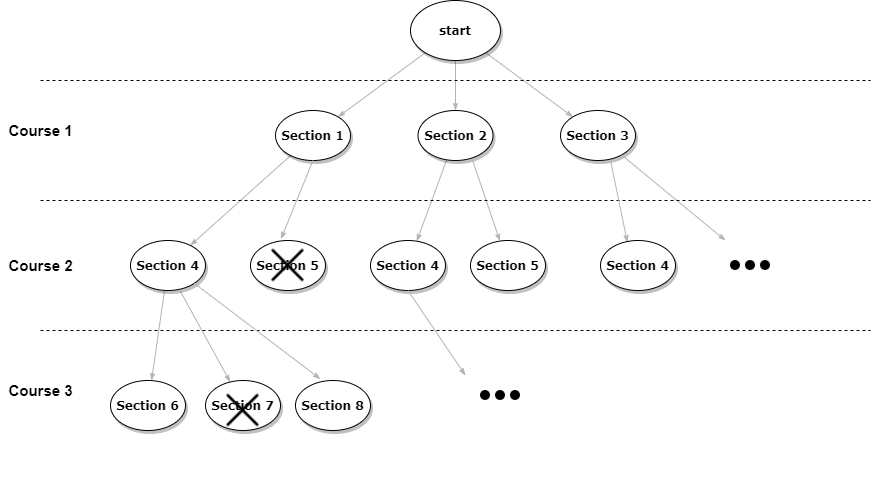

# my-course-enrollment

## 수강 시간표 제작 서비스 
수강 강의를 고르면 가능한 모든 시간표를 만들어주는 서비스

### 제약 조건
서비스는 다음 제약 조건을 만족한다.
- 학점은 1, 2, 3학점 중 하나이다.
- 1~2학점인 강의는 주 2시간의 수업을 진행하고, 3학점인 강의는 주 2시간 씩 2회 총 4시간의 수업을 진행한다.
- 강의 당 가능한 수업 시간은 3가지를 제공한다. (ex. 강의A는 월1/2교시, 수3/4교시, 금7/8교시 가능)
- 학점은 최소 18학점, 최대 21학점이다.
- 동일한 강의를 중복 수강할 수 없다.
- 수업은 월-금, 1-8교시에 가능하다.

### 전제 조건
위 제약 조건을 지키는 최소한의 시간표 제작 서비스를 만들기 위해 다음을 전제로 한다.
- 강의 데이터가 이미 입력되어 있다.
- 사용자는 로그인을 하지 않고 서비스를 이용할 수 있다.

---

### Domain
- Course
    - 개설되는 강의 정보를 관리한다.
    - [ ] 강의는 수업 시간에 따른 Sections를 제공한다.
- Sections
    - 강의가 제공하는 수업 목록을 관리한다.
    - [ ] Section의 개수는 3개이다.
- Section
    - 강의가 제공하는 수업 정보를 관리한다.
    - [ ] 1~2학점인 강의는 1개의 SectionTime, 3학점인 강의는 2개의 SectionTime을 가진다.
- SectionTime
    - 수업 진행 시간 정보를 관리한다.
    - [ ] 수업은 2교시씩 연달아 진행된다.
- Credit
    - [x] 학점은 1, 2, 3학점 중 하나이다.
- Weekday
    - [x] 요일은 월-금이다.
- Period
    - [x] 교시는 1-8교시이다.
- TimeTable
    - 한 학생의 수강 시간표 정보를 관리한다.
    - [ ] 동일한 과목을 중복 수강할 수 없다.
    - [ ] 수강 강의의 총 학점은 18-21힉점이다.
- TimeTableCell
    - 수강 시간표 한 셀의 정보를 관리한다.
- TimeTableMaker
    - [ ] 수강을 희망하는 강의 목록을 받아 가능한 모든 시간표 목록을 만든다.

---

### 만들 수 있는 모든 경우의 수의 시간표 구하기
- 조건: 각 Course는 여러 개의 Section을 가진다. Course별로 한 개의 Section씩 선택한다. Section들의 수업시간은 겹칠 수 없다.
- 백트래킹 방식으로 조건에 부합하지 않는 조합들을 제외해가며 답을 찾는다.  
- 아래 그림과 같은 구조로 검색을 한다.  
    
    1. Section의 조합을 담을 Stack을 준비한다.
    2. Course의 Section이 선택 가능한지 조건 검사한다.
    3. 선택 불가능이면 더 이상 자식 노드로 내려가지 않는다.
        1. 다른 형제 노드의 조건을 검사한다.
        2. 검사할 형제 노드가 없으면 부모 노드로 올라간다.
    4. 선택 가능하면 Stack에 담는다.
    5. 다음 Course의 Section을 검사한다.
    6. Stack에 마지막으로 추가된 Section을 제외시키고 다시 부모 노드로 올라간다.
- 조건에 부합하지 않으면 자식 노드를 검사하지 않으므로 모든 경우를 확인하는 것보다 시간이 적게 걸린다.

### 고려한 사항
- 같은 요청에 대한 시간표를 중복적으로 생성하지 않는다.
    - 선택한 Course들의 id로 만든 hash 값을 비교하여 중복적인 생성 요청인지 확인한다. (TimeTableList의 hash 속성)
    - hash 충돌 가능성이 있으므로 같은 hash 값이면 courseIds를 추가적으로 확인한다.
